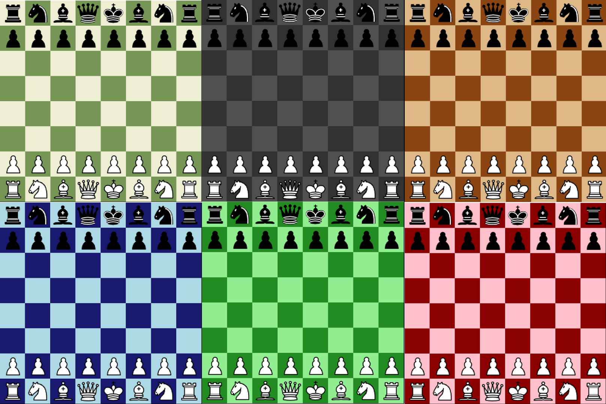

# ♟️ Chess Puzzle Game

Chess puzzle game. Includes customizable themes, adjustable AI difficulty, and multiple gameplay modes.

# Why I created this

Most popular chess apps lock their puzzle features behind paywalls. I built this game to offer free and open access to chess puzzles for anyone who wants to improve their skills—no subscriptions, no ads.

## Installation

1. Clone the repository:
    ```bash
    git clone https://github.com/Eklund2012/py-chess-puzzles.git
    cd py-chess-puzzles
    ```

2. Create a virtual environment:
    ```bash
    python -m venv venv
    ```

3. Activate the virtual environment:
    ```bash
    source venv/Scripts/activate  # On Linux or MacOS use `source venv/bin/activate`
    ```

4. Install dependencies:
    ```bash
    pip install -r requirements.txt
    ```

5. Run the game:
    ```bash
    python3 main.py
    ```

## Usage

The game offers the following modes:

- **Human vs Human**: Play against a friend on the same machine.
- **Human vs AI**: Play against the AI with selectable difficulty levels.
- **AI vs AI**: Watch two AIs play against each other.
- **Puzzle Mode**: Solve chess puzzles to improve your skills.

You can add or customize puzzles by editing the puzzles/puzzles.json file using FEN (Forsyth–Edwards Notation).
More about FEN [here](https://en.wikipedia.org/wiki/Forsyth%E2%80%93Edwards_Notation)

## Preview


## Contact

- Email: [david.eklund9@gmail.com](mailto:david.eklund9@gmail.com)
- LinkedIn: [www.linkedin.com/in/david-eklund02](https://www.linkedin.com/in/david-eklund02)
- Website: https://davideklund.com
